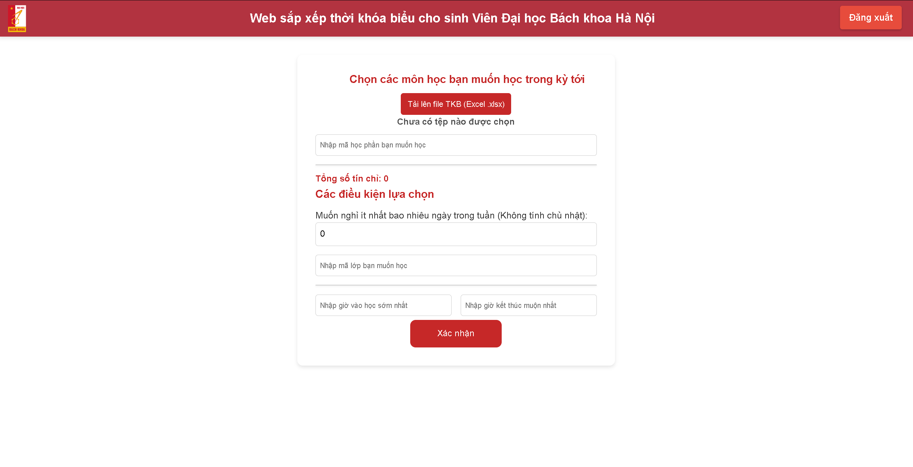

# hust-time-table-scheduler

A timetable scheduler for students at Hanoi University of Science and Technology

* Eng: This is a public version, a private one is going under progress and will be update here once finished. Instructions on how to run this will be published soon.

* Vi: Đây là bản repo public, mọi thứ vẫn đang được cải thiện và sẽ được update lên đây khi có tiến độ mới. Hướng dẫn sử dụng sẽ được thêm vào trong thời gian sắp tới.

  

## TODO List
* Add instructions to run the code
* Optimize with different solver (Genetic Algorithm, Heuristic,...)

## Credits
* Weekly schedule UI was built on the foundation of <a href="https://codyhouse.co/gem/schedule-template">CodyHouse Schedule Template </a>
